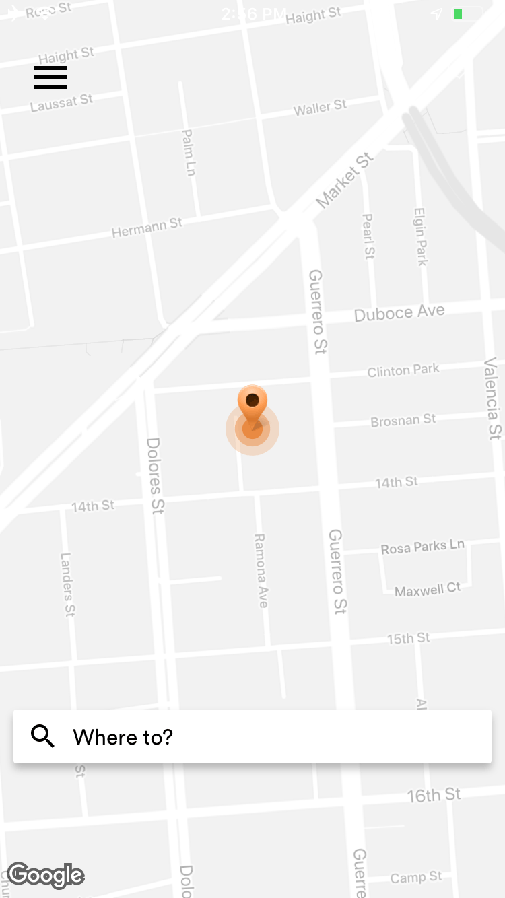
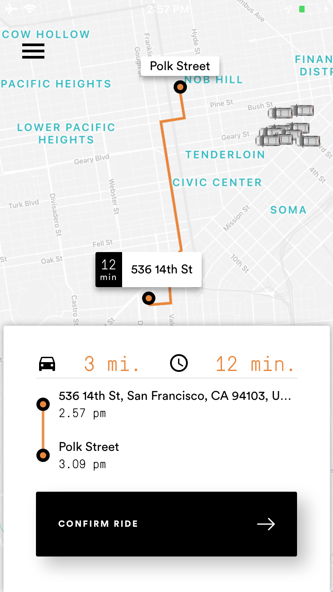

# <a name="0"></a>ChattyWagon 🚕

   

***

## Team
| [**Frank Faustino**](https://github.com/frankfaustino) | [**Johnathan Hugget**](https://github.com/JohnathanHuggett) |
|:----------------:|:----------------:|
| [](https://github.com/frankfaustino) | [](https://github.com/JohnathanHuggett) |
| [ Github](https://github.com/frankfaustino)  |  [ Github](https://github.com/JohnathanHuggett) |
| [  LinkedIn](https://www.linkedin.com/in/frankfaustino/) | [  LinkedIn](https://www.linkedin.com/in/johnathan-huggett-5b4946163/) |

***

## Contents

 - [Scripts](#scripts)
 - [Environment Variables](#environment-variables)
 - [Dependencies](#dependencies)
 - [Dev Dependencies](#dev-dependencies)


## Scripts

Starts or restarts a local server for the app
```bash
npm start
```

Opens the app in Expo in a currently running iOS simulator on your computer
```bash
npm run ios
```

Opens the app in Expo on a connected Android device
```bash
npm run android
```

Runs the Prettier code formatter
```bash
npm run prettier
```

_Note: `husky` and `lint-staged` automatically run upon `git commit`_

## Environment Variables
| Key | Description |
|-----|-------------|
|`apiKey`|Firebase API key|
|`authDomain`|Firebase Authorization Domain|
|`databaseURL`|Firebase Database URL|
|`projectId`|Firebase Project ID|
|`storageBucket`|Firebase Storage Bucket URL|
|`fbAppId`|Facebook Developer App ID|

## Dependencies

|Pkgs|Use|Description|Link|
|----|---|-----------|----|
|`react`|development|JavaScript library for building user interfaces|[docs](https://reactjs.org/)|
|`react-native`|development|framework for building native apps using React|[docs](https://facebook.github.io/react-native/)|
|`react-redux`|utility|React bindings for Redux|[github](https://github.com/reduxjs/react-redux)|
|`redux`|state mgmt|Predictable state container for JavaScript apps|[docs](https://redux.js.org/)|
|`redux-saga`|utility|Saga middleware for Redux to handle realtime data|[docs](https://redux-saga.js.org/)|
|`redux-thunk`|utility|Thunk middleware for Redux|[github](https://github.com/reduxjs/redux-thunk)|
|`react-navigation`|routing|Routing and navigation for React Native apps|[docs](https://reactnavigation.org/en/)|
|`react-navigation-redux-helpers`|routing|Redux middleware and utils for React Navigation|[github](https://github.com/react-navigation/react-navigation-redux-helpers#readme)|
|`firebase`|database|Firebase JavaScript library|[github](https://github.com/firebase/firebase-js-sdk)
|`geofire`|geolocation|Location-based querying and filtering using Firebase|[github](https://github.com/firebase/geofire-js/)|
|`react-native-maps`|maps|React Native Mapview component for iOS + Android|[github](https://github.com/react-community/react-native-maps#readme)|
|`lottie-react-native`|animation|React Native bindings for Lottie|[docs](http://airbnb.io/lottie/react-native/react-native.html#getting-started)|
|`moment`|utility|Parse, validate, manipulate, and display dates|[docs](http://momentjs.com/docs/)|
|`react-native-maps-directions`|maps|Directions Component for react-native-map|[github](https://github.com/bramus/react-native-maps-directions)|
|`react-native-google-places-autocomplete`|maps|Customizable Google Places autocomplete component for iOS and Android React-Native apps|[github](https://github.com/FaridSafi/react-native-google-places-autocomplete#readme)|
|`react-native-svg`|UI|SVG library for react-native|[github](https://github.com/react-native-community/react-native-svg#readme)|
|`react-native-global-props`|utility|Adds custom/default props to React Native components|[github](https://github.com/Ajackster/react-native-global-props#readme)|
|`react-native-responsive-screen`|utility|Make React Native views responsive for all devices|[github](https://github.com/marudy/react-native-responsive-screen#readme)|
|`prop-types`|utility|Runtime type checking for React props and similar objects|[docs](https://reactjs.org/docs/typechecking-with-proptypes.html#proptypes)|
|`expo`|development|Expo SDK|[docs](https://docs.expo.io/versions/latest/sdk/index.html)|

### Dev Dependencies

|Pkgs|Use|Description|Link|
|----|---|-----------|----|
|`babel-eslint`|linter|Custom parser for ESLint|[github](https://github.com/babel/babel-eslint)|
|`eslint`|linter|An AST-based pattern checker for JavaScript|[docs](https://eslint.org/)|
|`eslint-config-airbnb`|linter|Airbnb's ESLint config|[github](https://github.com/airbnb/javascript)|
|`eslint-plugin-import`|linter|Supports linting of ES6 import/export syntax|[github](https://github.com/benmosher/eslint-plugin-import)|
|`eslint-plugin-jsx-a11y`|linter|Static AST checker for accessibility rules on JSX elements|[github](https://github.com/evcohen/eslint-plugin-jsx-a11y#readme)|
|`eslint-plugin-react`|linter|React specific linting rules for ESLin|[github](https://github.com/yannickcr/eslint-plugin-react)|
|`exp`|development|The command-line tool for creating and publishing Expo apps|[github](https://github.com/expo/exp#readme)|
|`husky`|development|Pre-`git commit` linting hooks|[docs](https://github.com/typicode/husky/blob/master/DOCS.md)|
|`lint-staged`|development|Lint files staged by git|[github](https://github.com/okonet/lint-staged#readme)|
|`prettier`|development|Opinionated code formatter|[docs](https://prettier.io/)|
|`react-native-dotenv`|development|Babel preset that lets you `import` application configs from **.env** file|[npm](https://www.npmjs.com/package/react-native-dotenv)|

***

[](https://forthebadge.com)

[↑](#0) 👋

